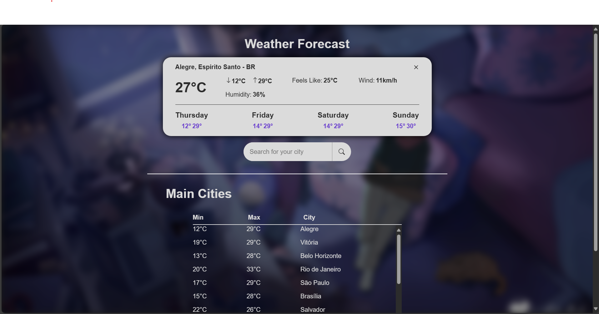
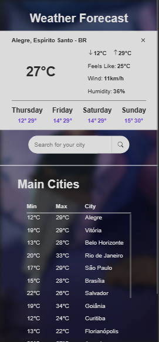

# Weather Forecast App

> A modern weather forecast web app built as a front-end challenge. Powered by Next.js, React, and TypeScript. Get real-time weather for major cities and search for any location using OpenMeteo and OpenWeatherMap APIs.

The app was deployed [here](https://react-challenge-01-weather-forecast.vercel.app/)

---

## 🌤️ Overview

This project is a solution to the [1STi front-end challenge](https://github.com/1STi/desafio-frontend/): create a beautiful, responsive weather forecast app that consumes public weather APIs.

**Features:**
- View weather forecasts for main cities
- Search for any city and get instant weather info
- Uses browser geolocation (with permission) to show your local weather
- Clean, modern UI with loading and error states

**All UI components were hand-crafted from scratch, without using any component libraries or CSS frameworks. This approach was chosen to deepen my CSS skills, focusing on modern CSS techniques such as Flexbox, Grid, custom properties, responsive layouts, and accessibility best practices. Through this project, I gained practical experience in building scalable and maintainable CSS for real-world applications.**

---

## 📸 Demo

### Desktop


## Phone


---

## 🚀 Getting Started

1. **Install dependencies:**
    ```bash
    yarn install
    # or
    npm install
    ```
2. **Run the development server:**
    ```bash
    yarn dev
    # or
    npm run dev
    ```
3. Open [http://localhost:3000/home](http://localhost:3000/home) in your browser.

You need to create your own API key to consume OpenWeather api and add it to a `.env` file at project root folder named `NEXT_PUBLIC_GEOCODING_API_KEY`.

You can create your own API keys [here](https://home.openweathermap.org/api_keys).

---

## 🕹️ Usage

- **Main Cities:** Instantly see the weather for a list of major cities.
- **Search:** Type at least 3 letters to search for any city worldwide.
- **Geolocation:** Allow browser geolocation to get your local weather.
- **Responsive:** Works great on desktop and mobile.

---

## 🛠️ Tech Stack

- [Next.js](https://nextjs.org/) (App Router)
- [React](https://react.dev/)
- [TypeScript](https://www.typescriptlang.org/)
- [OpenMeteo API](https://open-meteo.com/)
- [OpenWeatherMap API](https://openweathermap.org/)

---

## 🙏 Acknowledgments

- Challenge by [1STi](https://github.com/1STi)
- Weather data from [OpenMeteo](https://open-meteo.com/) and [OpenWeatherMap](https://openweathermap.org/)

---

_Feel free to fork, contribute, or reach out with feedback!_

